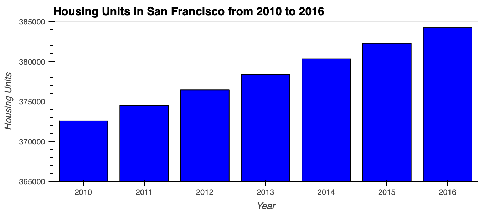
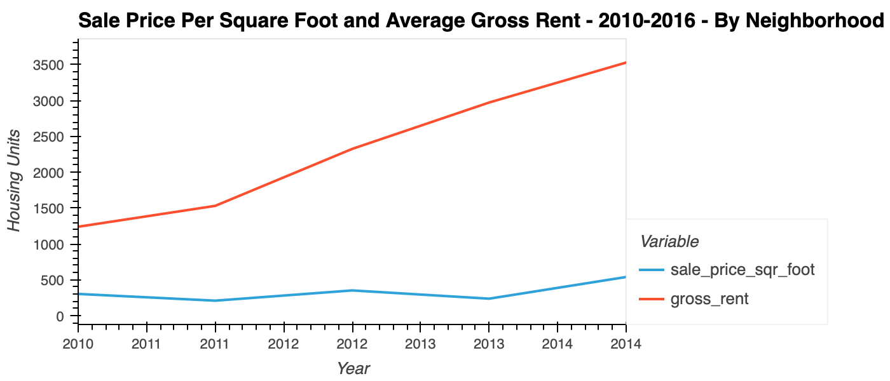
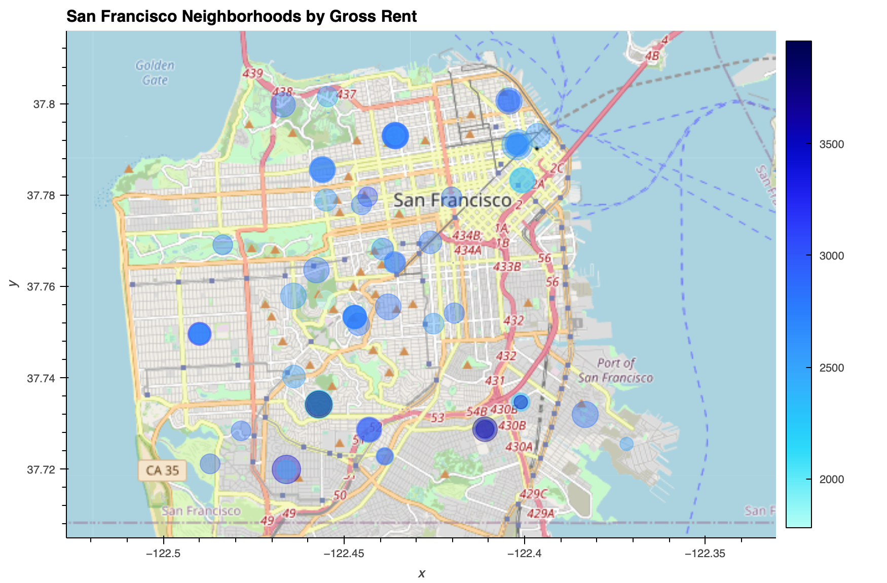

# PyViz Homework Assignment

## Background
---
**Proptech**, the application of technology to real-estate markets, is an innovative domain in the fintech industry. Assume that you’re an analyst at a proptech company that wants to offer an instant, one-click service for people to buy properties and then rent them. The company wants to have a trial of this offering in the San Francisco real-estate market. If the service proves popular, they can then expand to other markets.

Your job is to use your data visualization skills, including aggregation, interactive visualizations, and geospatial analysis, to find properties in the San Francisco market that are viable investment opportunities.

---
**The Python Notebook `san_francisco_housing.ipynb` contains my analysis of San Francisco's housing and rental market data.**

---
### Calculate and Plot the Housing Units per Year

1. Use the `groupby` function to group the data by year.
2. Aggregate the results by the `mean` of the groups.
3. Use the `hvplot` function to plot the `housing_units_by_year` DataFrame as a bar chart.
4. Make the x-axis represent the `year` and the y-axis represent the `housing_units`.
5. Style and format the line plot to ensure a professionally styled visualization.

* What’s the overall trend in housing units over the period that you’re analyzing?

---
### Calculate and Plot the Average Sale Prices per Square Foot

1. Group the data by year, and then average the results.
2. Create a new DataFrame named `prices_square_foot_by_year` by filtering out the “housing_units” column.
3. Use hvPlot to plot the `prices_square_foot_by_year` DataFrame as a line plot.
4. Style and format the line plot to ensure a professionally styled visualization.

5. Use both the `prices_square_foot_by_year` DataFrame and interactive plots to answer the following questions:

    * Did any year experience a drop in the average sale price per square foot compared to the previous year?
        * If so, did the gross rent increase or decrease during that year?

---

### Compare the Average Sale Prices by Neighborhood

1. Create a new DataFrame that groups the original DataFrame by year and neighborhood.
2. Aggregate the results by the `mean` of the groups.
3. Filter out the “housing_units” column to create a DataFrame that includes only the `sale_price_sqr_foot` and `gross_rent` averages per year.
4. Create an interactive line plot with hvPlot that visualizes both `sale_price_sqr_foot` and `gross_rent`.
5. Set the x-axis parameter to the year (`x="year"`). 
6. Use the `groupby` parameter to create an interactive widget for `neighborhood`.
7. Style and format the line plot to ensure a professionally styled visualization.

8. Use the interactive visualization to answer the following question:

    * For the Anza Vista neighborhood, is the average sale price per square foot for 2016 more or less than the price that’s listed for 2012? 

---

### Build an Interactive Neighborhood Map

1. Read the `neighborhood_coordinates.csv` file from the `Resources` folder into the notebook, and create a DataFrame named `neighborhood_locations_df`.
2. Set the `index_col` of the DataFrame as “Neighborhood”.
3. Using the original `sfo_data_df` Dataframe, create a DataFrame named `all_neighborhood_info_df` that groups the data by neighborhood.
4. Aggregate the results by the `mean` of the group.
5. Review the two code cells that concatenate the `neighborhood_locations_df` DataFrame with the `all_neighborhood_info_df` DataFrame.
6. Using hvPlot with GeoViews enabled, create a `points` plot for the `all_neighborhoods_df` DataFrame.

7. Use the interactive map to answer the following question:

    * Which neighborhood has the highest gross rent, and which has the highest sale price per square foot?

---

### Compose Your Data Story

Based on the visualizations that you created, answer the following questions:

* How does the trend in rental income growth compare to the trend in sales prices? Does this same trend hold true for all the neighborhoods across San Francisco?

* What insights can you share with your company about the potential one-click, buy-and-rent strategy that they're pursuing? Do neighborhoods exist that you would suggest for investment, and why?

5. Answer the following question:

    * What’s the overall trend in housing units over the period that you’re analyzing?

